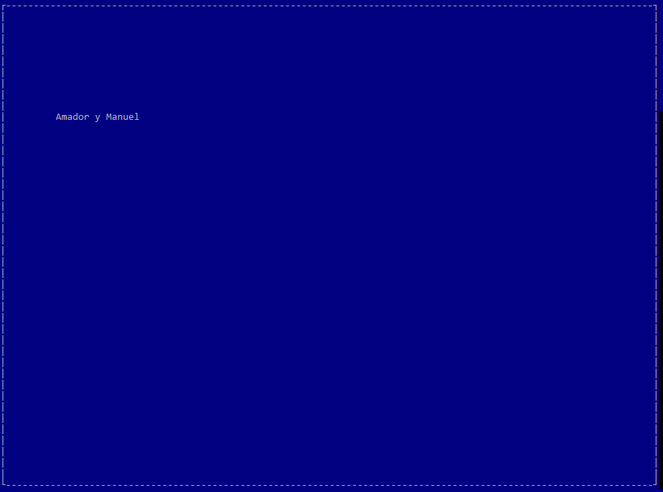
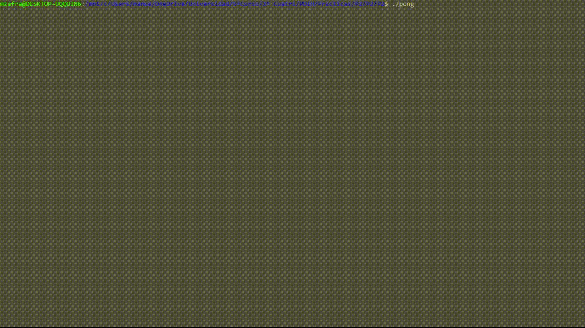
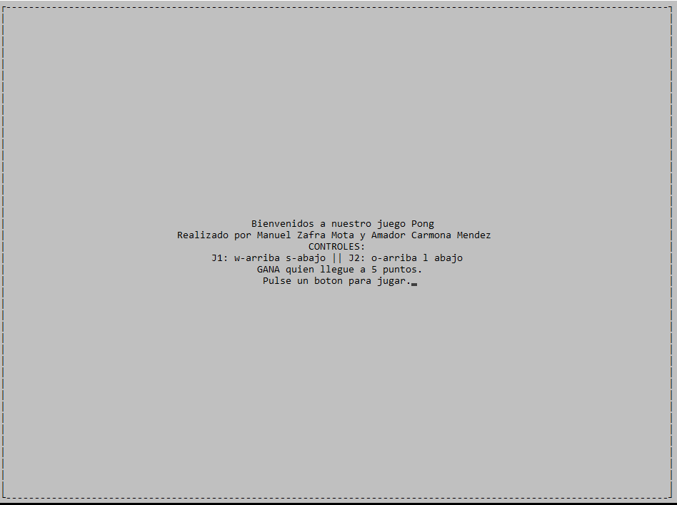
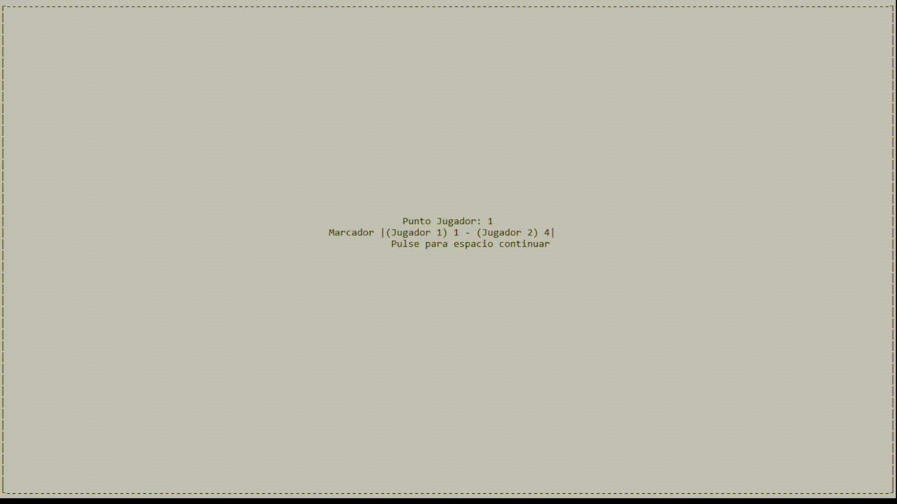
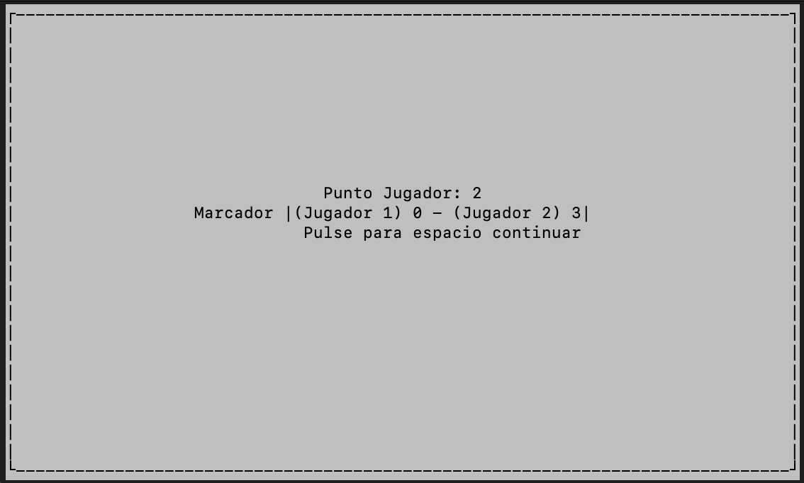
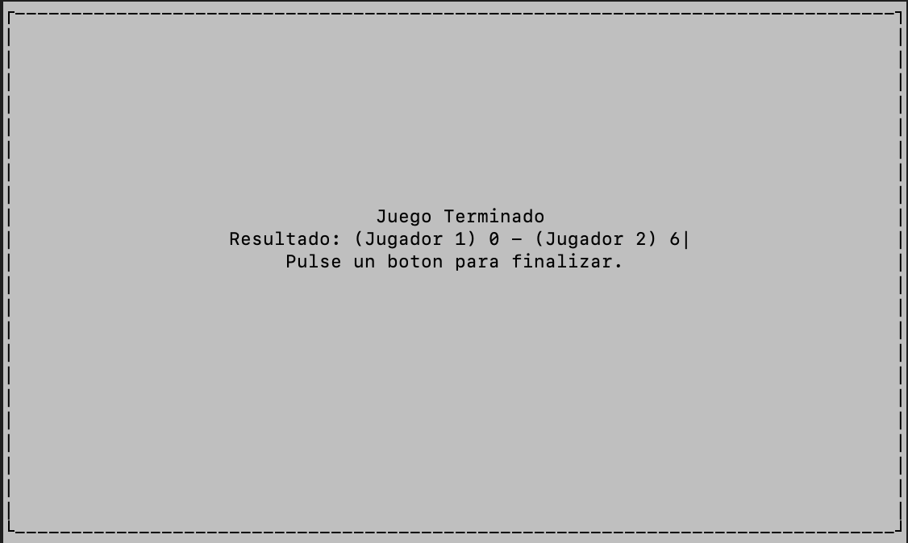

# Practica 2 - Pong # 

Autores: Amador Carmona Méndez y Manuel Zafra Mota

---
## Introducción ##
En esta práctica hemos utilizado la librería *ncurses* para realizar un juego sencillo parecido al "Pong".  

## Instalación ##
Para instalar la librería *ncurses* introduciremos el siguiente comando en la terminal de ubuntu:  

    sudo apt-get install libncurses5-dev libncursesw5-dev  

Este comando nos instalará la librería de *ncurses* y podremos disponer de ella para la realización de la práctica.

---

## Requisitos Mínimos ##

* **Ejecución Ventana.c**
  

* **Ejecucion Pelota.c**

* **Ejecución Pong.** 
Hemos puesto el delay bastante grande para poder jugar comodamente 

---

## Requisitos Ampliados ## 

* **Pantalla de Inicio**

El código de esta pantalla es el siguiente:  
~~~ C
   WINDOW *window = newwin(rows,cols,0,0);
    wbkgd(window, COLOR_PAIR(2));
    box(window, '|', '-');
    mvwprintw(window, (rows/2)-3, (cols/2)-15, "Bienvenidos a nuestro juego Pong");
    mvwprintw(window, (rows/2)-2, (cols/2)-28, "Realizado por Manuel Zafra Mota y Amador Carmona Mendez ");
    mvwprintw(window, (rows/2)-1, (cols/2)-5, "CONTROLES:");
    mvwprintw(window, (rows/2), (cols/2)-22, "J1: w-arriba s-abajo || J2: o-arriba l abajo");
    mvwprintw(window, (rows/2)+1, (cols/2)-14, "GANA quien llegue a 5 puntos.");
    mvwprintw(window, (rows/2)+2, (cols/2)-13, "Pulse un boton para jugar.");
    wrefresh(window);
    usleep(DELAY);
    getch();
    endwin();
~~~
* **Pantalla de Juego**

~~~C
void juego(){
    int x = 0, y = 0;
    int max_y = 250, max_x =250;
    int next_x = 0,next_y=0;
    int directionx = 1;
    int directiony = 1;
    int rows, cols;
    int j1x,j1y;
    int j2x,j2y;

    //Pantalla de juego
    initscr();
    start_color();
    init_pair(1, COLOR_YELLOW, COLOR_GREEN);
    init_pair(2, COLOR_BLACK, COLOR_WHITE);
    init_pair(3, COLOR_WHITE,COLOR_BLUE);
    clear();
    refresh();
    getmaxyx(stdscr, rows, cols);
    WINDOW *window = newwin(rows,cols,0,0);
    /*wbkgd(window, COLOR_PAIR(2));
    box(window, '|', '-');*/
    //inicializo variables de rango maximo y posicion incial de la pelota
    max_x=cols;
    max_y=rows;
    next_x=max_x/2;
    next_y=max_y/2;
    x=max_x/2;
    y=max_y/2;
    //inicializo posiciones iniciales de los jugadores:
    j1x=0;
    j1y=max_y/2;
    j2x=max_x-1;
    j2y=max_y/2;

    initscr();
    noecho();
    //Juego
    curs_set(FALSE);
    while(PuntosJ1<=5 && PuntosJ2<=5) {
        clear();
        mvprintw(0, (cols/2)-10, "Jugador1:%d |Jugador2:%d",PuntosJ1,PuntosJ2);
        mvprintw(next_y, next_x, "O");
        //Pintamos al jugador 1
        mvprintw(j1y + 1, j1x,"|");
        mvprintw(j1y + 2, j1x,"|");

        //Pintamos al jugador 2
        mvprintw(j2y + 1, j2x,"|");
        mvprintw(j2y + 2, j2x,"|");
        refresh();
        usleep(DELAY);

        //Movimiento de la pelota:
        next_x = x + directionx;
        next_y = y + directiony;
        //ejey si llega al maximo rebota si no avanza
        if (next_y >= max_y || next_y <= 0)
        {
            directiony *= -1;
        }else{
            y += directiony;
        }
        //ejex si llega al maximo y toca a un jugador rebota si no avanza
        if (next_x == j1x && (next_y <= (j1y+2) && next_y >= j1y)){
            directionx *= -1;
        }else if(next_x == j2x && (next_y <= (j2y+2) && next_y >= j2y)){
            directionx *= -1;
        }else{
            x += directionx;
        }

        //movimiento de los jugadores: (Leemos el caracter del teclado sin pausar el juego )
        char gtch=wgetch(window);
        nodelay(window, true);
        switch (gtch)
        {
        case 'w':
            if (j1y >= 2)
            j1y -= 1;
            break;

        case 's':
            if (j1y + 2 <= max_y - 2)
            j1y += 1;
            break;

        case 'o':
            if (j2y >= 2)
            j2y -= 1;
            break;

        case 'l':
            if (j2y + 2 <= max_y - 2)
            j2y += 1;
            break;

        default:
            break;
        }

        //Marcador:
        if(j1x>next_x){
        PuntosJ1++;
        //inicializamos pelota y jugadores:
        pantalla_punto(1);
        x=max_x/2;
        y=max_y/2;
        j1x=0;
        j1y=max_y/2;
        j2x=max_x-1;
        j2y=max_y/2;
        }
        if(j2x<next_x){
        PuntosJ2++;
        pantalla_punto(2);
        //inicializamos pelota y jugadores:
        x=max_x/2;
        y=max_y/2;
        j1x=0;
        j1y=max_y/2;
        j2x=max_x-1;
        j2y=max_y/2;
        }
        refresh();

    }

    //refrescar pantalla de juego
    wrefresh(window);
}
~~~

* **Pantalla de Anotacion de un Punto**

~~~C
void pantalla_punto(int jugador){
    int rows, cols;
    initscr();
    if (has_colors() == FALSE) {
        endwin();
        printf("El terminal no tiene soporte de color \n");
        exit(1);
    }
    start_color();
    init_pair(1, COLOR_YELLOW, COLOR_GREEN);
    init_pair(2, COLOR_BLACK, COLOR_WHITE);
    init_pair(3, COLOR_WHITE,COLOR_BLUE);
    clear();
    refresh();
    getmaxyx(stdscr, rows, cols);
    WINDOW *window = newwin(rows,cols,0,0);
    wbkgd(window, COLOR_PAIR(2));
    box(window, '|', '-');
    mvwprintw(window, (rows/2)-3, (cols/2)-8, "Punto Jugador: %d",jugador);
    mvwprintw(window, (rows/2)-2, (cols/2)-21, "Marcador |(Jugador 1) %i - (Jugador 2) %i|",PuntosJ1,PuntosJ2);
    mvwprintw(window, (rows/2)-1, (cols/2)-10, "Pulse para espacio continuar");
    usleep(DELAY);
    wrefresh(window);
    getch();
    endwin();

}
~~~
* **Pantalla de Fin del Juego**

~~~ C

void pantalla_final(){
    int rows, cols;
    initscr();
    if (has_colors() == FALSE) {
        endwin();
        printf("El terminal no tiene soporte de color \n");
        exit(1);
    }
    start_color();
    init_pair(1, COLOR_YELLOW, COLOR_GREEN);
    init_pair(2, COLOR_BLACK, COLOR_WHITE);
    init_pair(3, COLOR_WHITE,COLOR_BLUE);
    clear();
    refresh();
    getmaxyx(stdscr, rows, cols);
    WINDOW *window = newwin(rows,cols,0,0);
    wbkgd(window, COLOR_PAIR(2));
    box(window, '|', '-');
    mvwprintw(window, (rows/2)-3, (cols/2)-7, "Juego Terminado");
    mvwprintw(window, (rows/2)-2, (cols/2)-20, "Resultado: (Jugador 1) %i - (Jugador 2) %i|",PuntosJ1,PuntosJ2);
    mvwprintw(window, (rows/2)-1, (cols/2)-15, "Pulse un boton para finalizar.");
    mvwprintw(window, (rows/2)-1, (cols/2)-15, "Pulse un boton para finalizar.");
    wrefresh(window);
    usleep(DELAY);
    getch();

    endwin();
    
}

~~~
* **Main**
Este es el main donde llamamos a todas las funciones anteriores de pantallas, las variables PuntosJ1 y PuntosJ2 estan declaradas globalmente para poder ponerlas en las diferentes pantallas.

~~~ C

int main(int argc, char *argv[]) {
//Realizamos una pantalla que al iniciar el juego se muestre una pantalla de bienvenida en la que se muestren los datos de quienes han realizado el juego y explicando los controles de juego (p.ej. un recuadro con la explicación).
pantalla_inicio();
//Implementación del juego
juego();
//Realizamos una pantalla que al terminar cada partida se muestre una pantalla de resumen mostrando el marcador final y felicitando al ganador. Se dará la opción de volver a jugar o terminar el programa.
pantalla_final();
}
~~~
