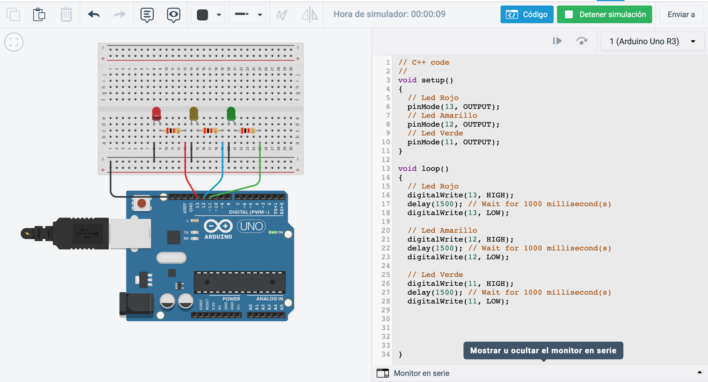
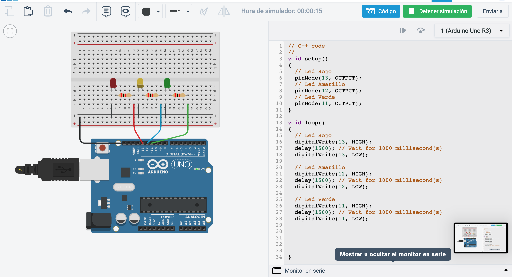
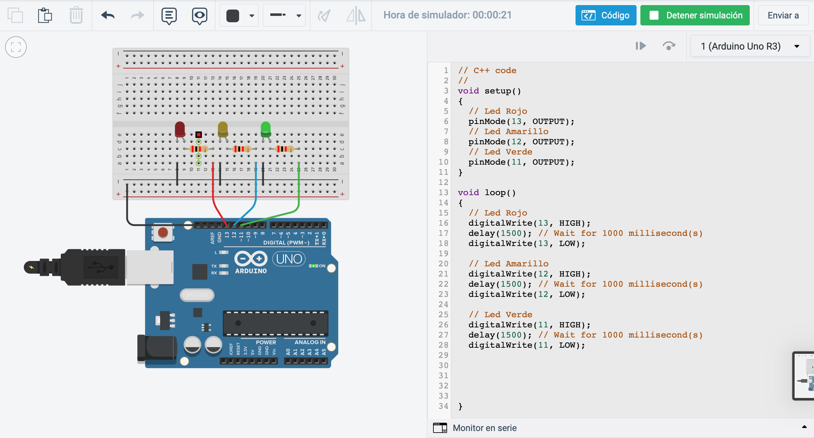
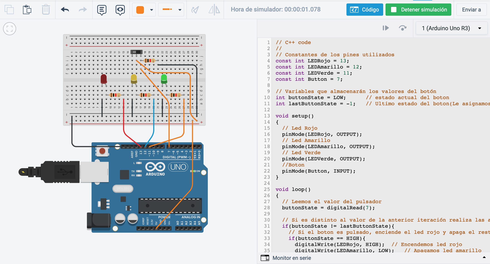
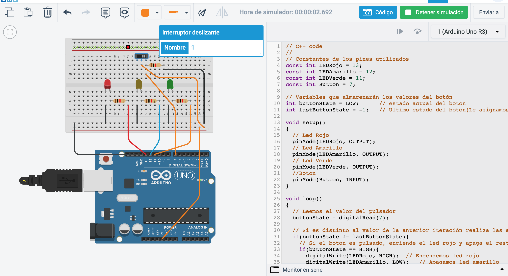
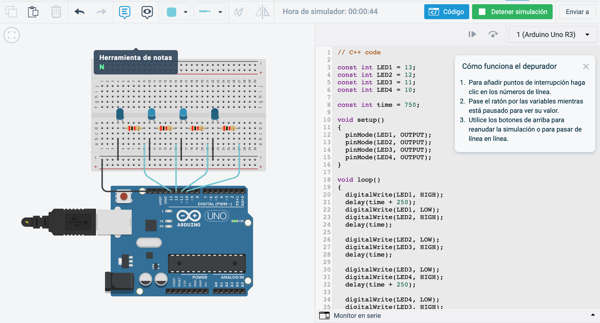

# Practica 3 - Arduino # 

Autores: Amador Carmona Méndez y Manuel Zafra Mota

---
## Introducción ##
En esta práctica se propone crear y verificar el funcionamiento de diversos sistemas de control basados en Arduino.  

## Instalación ##
Utilizaremos el simulador de arduino en linea dado en el seminario cuya URL es: https://www.tinkercad.com/circuits.

Crearemos nuestro codigo para arduino y lo probaremos en este entorno online.

---

## Requisitos Mínimos ##

### Ejercicio 1 ###
Implementar el programa de parpadeo de LED, ampliándolo para que encienda y apague alternativamente tres LEDs (uno rojo, otro amarillo y otro verde), conectados a las salidas digitales 11, 12 y 13 del Arduino, a un intervalo de 1.5 segundos. Crear el esquema con Fritzing y cargar el programa en Arduino para comprobar que funciona correctamente.

---

#### Circuito ####
Componentes del circuito: Cable, 3 resistencias, 3 leds, placa arduino, placa de pruebas.

Enlace del circuito: https://www.tinkercad.com/things/1azfDwPMMmk-fabulous-jaagub/editel?sharecode=RzmaknUdQvgRScbzRs5yTkZ5WKP36na4HGJ6hd1Juas

---

#### Codigo ####

~~~ C++
// C++ code
//
void setup()
{
// Led Rojo
pinMode(13, OUTPUT);
// Led Amarillo
pinMode(12, OUTPUT);
// Led Verde
pinMode(11, OUTPUT);
}

void loop()
{
// Led Rojo
digitalWrite(13, HIGH);
delay(1500); // Wait for 1000 millisecond(s)
digitalWrite(13, LOW);

// Led Amarillo
digitalWrite(12, HIGH);
delay(1500); // Wait for 1000 millisecond(s)
digitalWrite(12, LOW);

// Led Verde
digitalWrite(11, HIGH);
delay(1500); // Wait for 1000 millisecond(s)
digitalWrite(11, LOW);
}

~~~

---

### Ejercicio 2 ###
Partir del programa de parpadeo de LEDs anterior y ampliarlo con las modificaciones necesarias para que se encienda el LED rojo solo cuando se pulse un interruptor conectado a la entrada digital 7, y en ese momento se apaguen los LEDs amarillo y verde.

---

#### Circuito ####
Componentes del circuito: Cable, 3 resistencias, 3 leds, placa arduino, placa de pruebas, interruptor

Enlace del circuito: https://www.tinkercad.com/things/hqLqHLHJ8Gc-shiny-jaiks-tumelo/editel?sharecode=QNZwgF9GTageBY5b6I3l2mqRAYNRRL5Rruk7Q1eegCo

---

#### Codigo ####

~~~ C++
// C++ code
//
// Constantes de los pines utilizados
const int LEDRojo = 13;
const int LEDAmarillo = 12;
const int LEDVerde = 11;
const int Button = 7;

// Variables que almacenarán los valores del botón
int buttonState = LOW;        // estado actual del boton
int lastButtonState = -1;    // Ultimo estado del boton(Le asignamos -1 para que sea distinto que el estado inicial y encienda los leds amarillo y verde desde un inicio

void setup()
{
// Led Rojo
pinMode(LEDRojo, OUTPUT);
// Led Amarillo
pinMode(LEDAmarillo, OUTPUT);
// Led Verde
pinMode(LEDVerde, OUTPUT);
//Boton
pinMode(Button, INPUT);  
}

void loop()
{
// Leemos el valor del pulsador
buttonState = digitalRead(7);

// Si es distinto al valor de la anterior iteración realiza las acciones
if(buttonState != lastButtonState){
// Si el boton es pulsado, enciende el led rojo y apaga el resto
if(buttonState == HIGH){
digitalWrite(LEDRojo, HIGH);    // Encendemos led rojo
digitalWrite(LEDAmarillo, LOW);    // Apagamos led amarillo
digitalWrite(LEDVerde, LOW);    // Apagamos led verde
}else{// Una vez dejamos de pulsar el boton, se apaga el led rojo y se encienden el resto
digitalWrite(LEDRojo, LOW);
digitalWrite(LEDAmarillo, HIGH);
digitalWrite(LEDVerde, HIGH);
}
}
// Cambiamos al último estado leído
lastButtonState = buttonState;

}

~~~

---

## Requisitos Ampliados ## 
Requisitos ampliados (opcionales para subir nota): Se propone realizar alguno de los siguientes proyectos, más avanzados y complejos para subir nota hasta 10 puntos:
1. Secuencia de LEDs, encendiendo y apagando 4 LEDs secuencialmente, de forma similar a las lucecitas de "El coche fantástico": https://bit.ly/3Lu7YNz

---

#### Circuito ####
Componentes del circuito: Cable, 4 resistencias, 4 leds, placa arduino, placa de pruebas.

Enlace del circuito: https://www.tinkercad.com/things/11u54Evc1GQ-powerful-lahdi/editel?sharecode=qQOtkN0R0Hr_FvsCv-WoHgSRjeeGuE5lF4UBJKO3Ov0

---

#### Codigo ####

~~~ C++
// C++ code

const int LED1 = 13;
const int LED2 = 12;
const int LED3 = 11;
const int LED4 = 10;

const int time = 750;

void setup()
{
pinMode(LED1, OUTPUT);
pinMode(LED2, OUTPUT);
pinMode(LED3, OUTPUT);
pinMode(LED4, OUTPUT);
}

void loop()
{
digitalWrite(LED1, HIGH);
delay(time + 250);
digitalWrite(LED1, LOW);
digitalWrite(LED2, HIGH);
delay(time);

digitalWrite(LED2, LOW);
digitalWrite(LED3, HIGH);
delay(time);

digitalWrite(LED3, LOW);
digitalWrite(LED4, HIGH);
delay(time + 250);

digitalWrite(LED4, LOW);
digitalWrite(LED3, HIGH);
delay(time);

digitalWrite(LED3, LOW);
digitalWrite(LED2, HIGH);
delay(time);

digitalWrite(LED2, LOW);  

}

~~~
