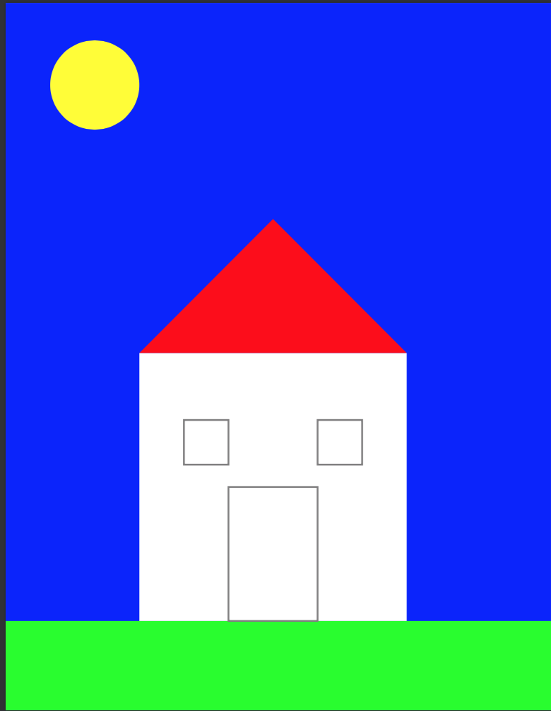
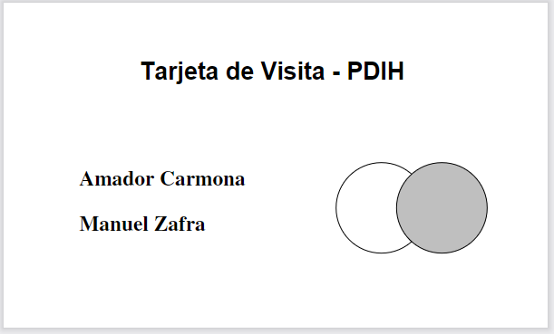
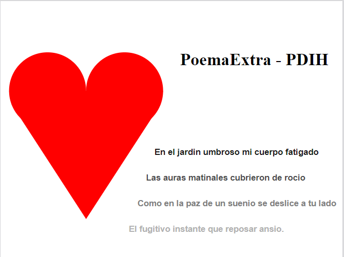

# Practica 4 - PostScript #

Autores: Amador Carmona Méndez y Manuel Zafra Mota

---

## Introducción ##

En esta practica vamos a trabajar y conocer Postscript y vamos a crear varios documentos y comprobar estos con un visor de Postscript, también veremos como pasar archivos de este formato a pdf.

## Instalación ##

En este caso no hace falta ninguna Instalación, como visor de Postscript utilizaremos "Vista Previa" de MacOs y trabajaremos con un editor de textos como VisualStudio, SublimeText o "Editor de Texto" de MacOs.

---

## Requisitos Mínimos ##

### Ejercicio 1 ###

Página en la que se muestre el dibujo de una casita

#### Resultado ####

#### Codigo ####

~~~ Postscript
%!PS
% Práctica 4 - Postscript
% Realizado por: Amador Carmona Méndez y Manuel Zafra Mota

% Configuración de colores
/gris {0.5 0.5 0.5 setrgbcolor} def   % Gris
/blanco {1 1 1 setrgbcolor} def       % Blanco
/verde {0 1 0 setrgbcolor} def        % Verde
/azul {0 0 1 setrgbcolor} def         % Azul
/amarillo {1 1 0 setrgbcolor} def     % Amarillo
/rojo {1 0 0 setrgbcolor} def         % Rojo

% Configuración de líneas
2 setlinewidth

% Dibujar fondo azul
newpath
0 0 moveto
0 792 lineto
612 792 lineto
612 0 lineto
closepath
azul fill

% Dibujar sol amarillo
newpath
100 700 50 0 360 arc
amarillo fill

% Dibujar suelo verde
newpath
0 0 moveto
0 100 lineto
612 100 lineto
612 0 lineto
closepath
verde fill

% Dibujar Casa Blanca
newpath
150 100 moveto
150 400 lineto
450 400 lineto
450 100 lineto
closepath
blanco fill

% Dibujar Tejado en rojo/marrón
newpath
150 400 moveto
300 550 lineto
450 400 lineto
closepath
rojo fill

% Dibujar Ventanas
newpath
200 275 moveto
200 325 lineto
250 325 lineto
250 275 lineto
closepath
gris stroke

newpath
350 275 moveto
350 325 lineto
400 325 lineto
400 275 lineto
closepath
gris stroke

% Dibujar Puerta
newpath
250 100 moveto
250 250 lineto
350 250 lineto
350 100 lineto
closepath
gris stroke

showpage
~~~

### Ejercicio 2 ###

Página en la que diseñes una tarjeta de visita

#### Resultado ####

#### Codigo ####

~~~Postscript
%!PS
% Establecer el tamaño de página para la tarjeta de visita (en puntos)
<< /PageSize [360 216] >> setpagedevice
% ----- FIGURAS DE LA TARJETA ------ % 
% Generar el logo (un círculo blanco dentro de un cuadrado) en la parte derecha
newpath
    % 0 0 moveto
    0.5 setlinewidth % Ancho de línea
    250 80 30 0 360 arc
    closepath 
stroke
newpath
    290 80 30 0 360 arc
    closepath % Círculo
    gsave
        0.75 setgray 
        fill
    grestore
stroke
% ----- TEXTO DE LA TARJETA ----- %
% Titulo
/Helvetica-Bold findfont 
16 scalefont 
0 setgray
setfont % Fuente y tamaño del texto
newpath
    90 165 moveto
    (Tarjeta de Visita - PDIH) show
stroke
% Nombres
/Times-Roman-Bold findfont
14 scalefont
setfont
newpath
    50 95 moveto % Posición inicial del texto
    (Amador Carmona) show % Mostrar el texto
stroke
newpath
    50 65 moveto % Posición inicial del texto
    (Manuel Zafra) show % Mostrar el texto
stroke
showpage
~~~

---

### Requisitos Ampliados ###

Una página con el siguiente diseño: el dibujo de un corazón y un texto en varios tonos de gris

#### Resultado ####

#### Codigo ####

~~~Postscript
%!PS
% Práctica 4 - Postscript
% Realizado por: Amador Carmona Méndez y Manuel Zafra Mota
<< /PageSize [400 300] >> setpagedevice
% Definir colores en tonos de gris
/gray1 0.1 def
/gray2 0.3 def
/gray3 0.5 def
/gray4 0.7 def
/gray5 0.9 def

% ----- CORAZÓN ----- %
% Parte superior del corazón
newpath
    1 0 0 setrgbcolor
    55 195 45 0 360 arc
    fill
    closepath
stroke
newpath
    145 195 45 0 360 arc
    fill
    closepath
stroke
% Parte inferior del corazón
newpath
    10 195 moveto
    190 195 lineto
    187 179 lineto
    100 45 lineto
    13 179 lineto
    closepath
    fill
stroke

% ----- TEXTO ----- %
/textPosX 180 def
/textPosY 120 def
/textSize 10 def
/textFont {/Helvetica-Bold findfont textSize scalefont} def

% Título
/Times-Bold findfont
20 scalefont
0.0 setgray
setfont
newpath
    210 225 moveto
    0.0 setgray
    (PoemaExtra - PDIH) show
stroke
% Texto del Poema
textFont setfont
newpath
    textPosX textPosY moveto
    gray1 setgray 
    (En el jardin umbroso mi cuerpo fatigado) show
stroke
newpath
    textPosX 10 sub textPosY 30 sub moveto
    gray2 setgray 
    (Las auras matinales cubrieron de rocio) show
stroke
newpath
    textPosX 20 sub textPosY 60 sub moveto
    gray3 setgray
    (Como en la paz de un suenio se deslice a tu lado) show
stroke
newpath
    textPosX 30 sub textPosY 90 sub moveto
    gray4 setgray 
    (El fugitivo instante que reposar ansio.) show
stroke
% Mostrar la tarjeta
showpage
~~~
