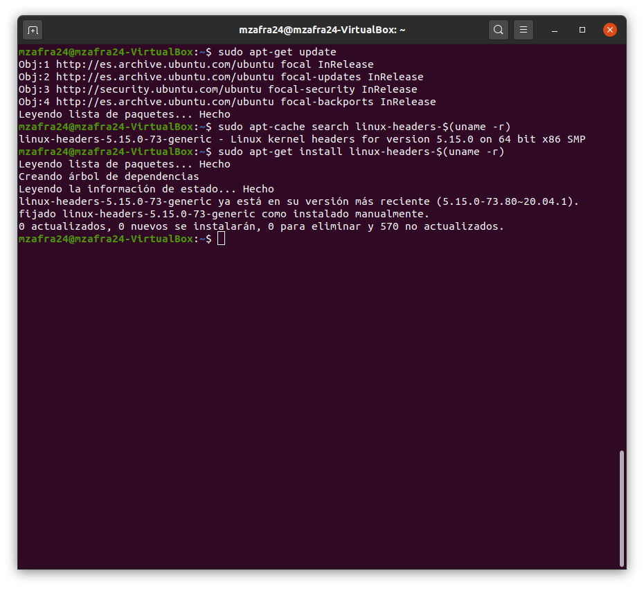
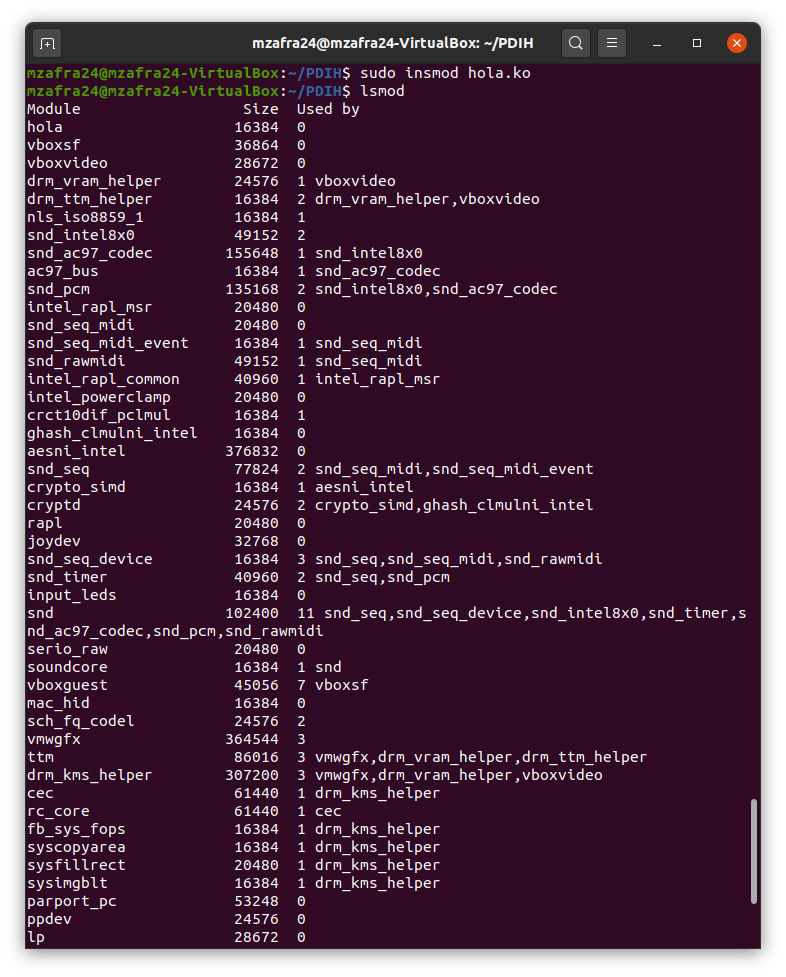
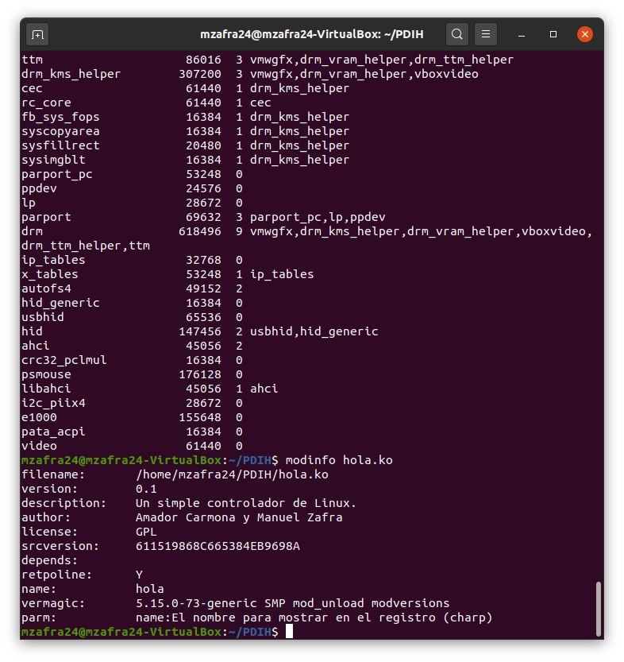
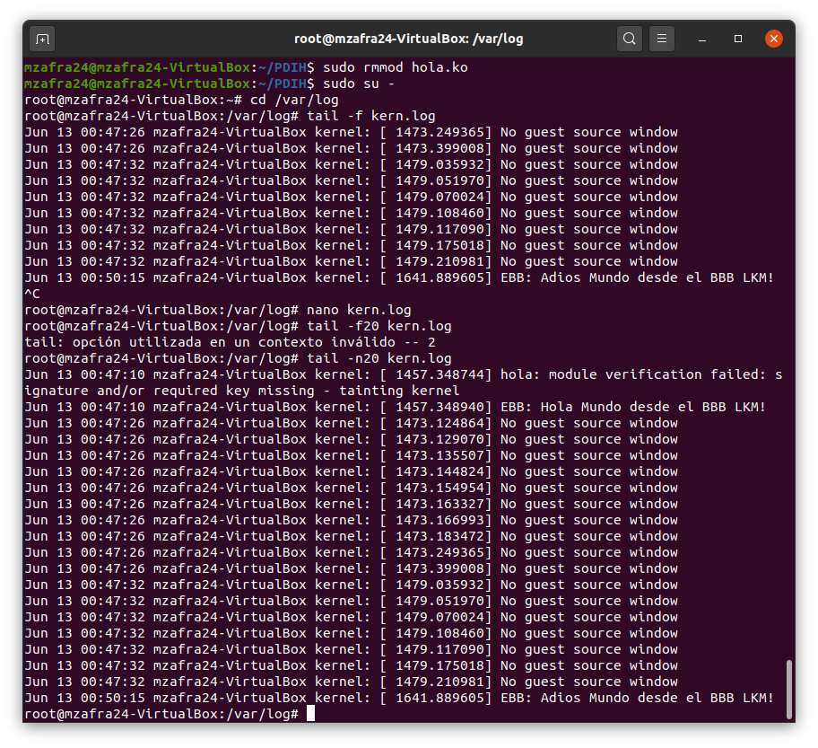

# Seminario: Módulos cargables del kernel - LKM #
Autores: Amador Carmona Méndez y Manuel Zafra Mota

---
## Preparar el sistema para construir un LKM ##
Primero comprobaremos que tenemos las cabeceras de Linux instaladas utilizando los comandos siguientes:

~~~ bash
$ sudo apt-get update
$ sudo apt-cache search linux-headers-$(uname -r)
$ sudo apt-get install linux-headers-$(uname -r)
~~~

## Código del módulo creado ##
Hemos implementado un código sencillo que muestra por pantalla “EBB: Hola Mundo desde el BBB LKM!” y “EBB: Adios mundo desde el BBB LKM!” cuando se ejecuta la función printk() en el registro del log del kernel.

~~~ C
#include <linux/init.h>
#include <linux/module.h>
#include <linux/kernel.h>
MODULE_LICENSE("GPL"); ///< tipo de licencia
MODULE_AUTHOR("Amador Carmona y Manuel Zafra"); ///< Autores
MODULE_DESCRIPTION("Un simple controlador de Linux."); ///< descripción
MODULE_VERSION("0.1"); ///< Versión del módulo
static char *name = "Mundo";
module_param(name, charp, S_IRUGO);
MODULE_PARM_DESC(name, "El nombre para mostrar en el registro");
/** @brief The LKM initialization function
* @return returns 0 if successful
*/
static int __init helloBBB_init(void){
	printk(KERN_INFO "EBB: Hola %s desde el BBB LKM!\n", name);
	return 0;
}
/** @brief The LKM cleanup function
*/
static void __exit helloBBB_exit(void){
	printk(KERN_INFO "EBB: Adios %s desde el BBB LKM!\n", name);
}
/** @brief Identify the initialization function at insertion
time and the cleanup function
*/
module_init(helloBBB_init);
module_exit(helloBBB_exit);
~~~

Ademas hemos realizado un Makefile para poder compilar el archivo anterior y obtener un fichero LKM llamado hola.ko. El código del Makefile es el siguiente:

~~~ C
obj-m+=hola.o
all:
	make -C /lib/modules/$(shell uname -r)/build/ M=$(PWD) modules
clean:
	make -C /lib/modules/$(shell uname -r)/build/ M=$(PWD) 
~~~
## Prueba del módulo LKM ##
Para probar el módulo LKM que acabamos de crear lo primero que hemos hecho ha sido cargar el módulo, mediante el uso del comando `$ sudo insmod hola.ko`. A continuación, comprobamos que se ha creado correctamente con el comando `$ lsmod` .

Para obtener la información del módulo podemos ejecutar el comando `$ modinfo hola.ko`.

Por último, eliminaremos el módulo del kernel con el comando `$ sudo rmmod hola-ko` y comprobamos la salida de la función *printk()* en el registro del kernel. Para comprobar la salida hay que inciarse con el usuario root (`$ sudo su -`) y moverse al directorio */var/log* y mostrar el final del archivo *kern.log* (Usamos el comando: `$ tail -n 20 kern.log`)

