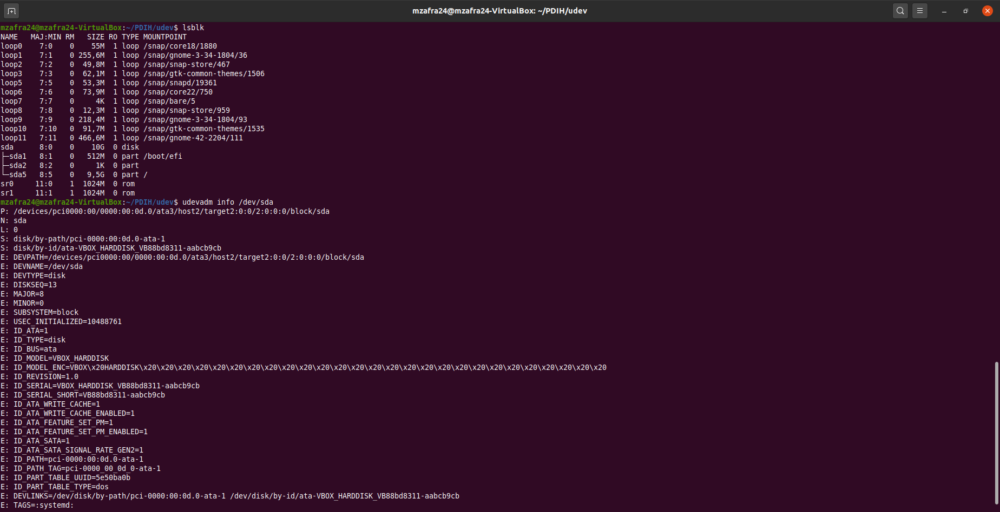
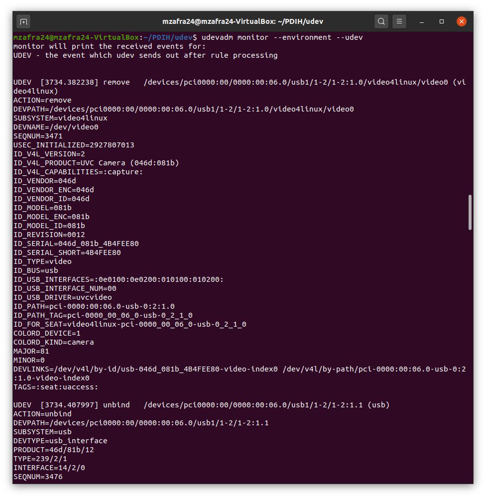
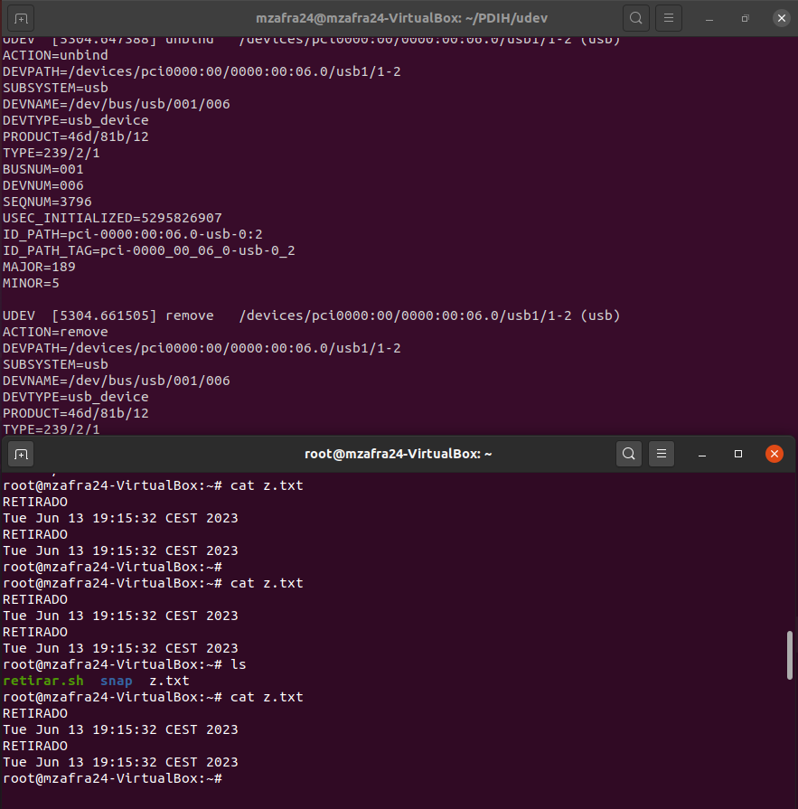
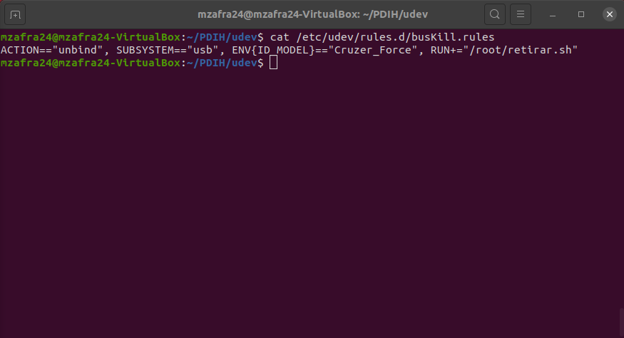

# Seminario - Gestor de dispositivos udev de Linux #

Autores: Amador Carmona Méndez y Manuel Zafra Mota

---

## Consultar los atributos de los dispositivos conectados al sistema ##
Podemos obtener esta información a través de los comando siguientes:
~~~ bash
$ lsblk
$ udevadm info /dev/sda
~~~

## Crear una regla udev
Lo primero que necesitamos hacer para crear una regla *udev* es hacer un script en la carpeta /root/ que llamaremos "retirar.sh". El contenido del script es el siguiente:

~~~ bash
#!/bin/bash
echo RETIRADO >> /root/z.txt
date >> /root/z.txt
echo " " >> z.txt
~~~

A continuación, crearemos un nuevo fichero  en el directorio /etc/udev/rules.d/ denominado "busKill.rules" donde se detallará el evento que vamos a comprobar y la acción que se ha realizado. Para ello introduciremos los siguientes comandos por la terminal:

~~~ bash
$ cat << EOF | sudo tee /etc/udev/rules.d/busKill.rules 
ACTION=="unbind", SUBSYSTEM=="usb", RUN+="/root/retirar.sh" 
EOF
$ sudo udevadm control --reload
$ cat /etc/udev/rules.d/busKill.rules
~~~

## Mejorando la regla udev ##
Para que el script solo se ejecute cada vez que se retire un dispositivo concreto del sistema. Observando los eventos anteriormente mostrados, sabemos que el ID_MODEL del dispositivo USB que estamos usando es *Cruzer_Force*. Sabiendo esto, modificaremos el archivo busKill.rules de la siguiente manera:
~~~ bash
$ cat << EOF | sudo tee /etc/udev/rules.d/busKill.rules
ACTION=="unbind", SUBSYSTEM=="usb", ENV{ID_MODEL}=="Cruzer_Force", RUN+="/root/retirar.sh"
EOF
~~~

