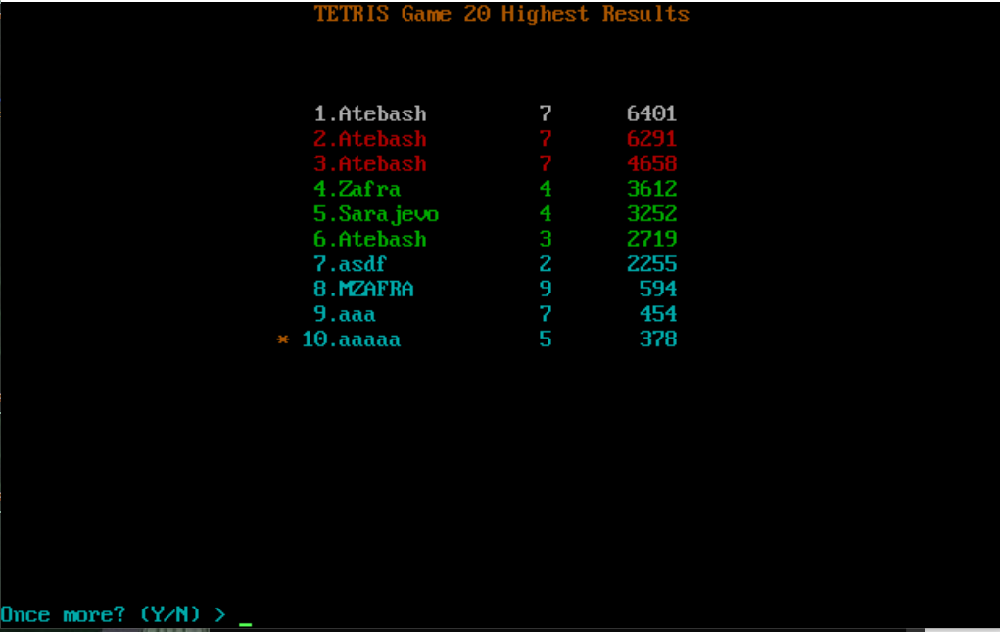
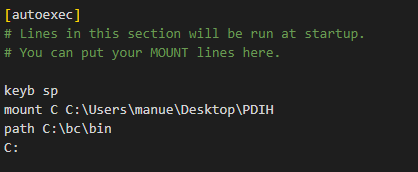
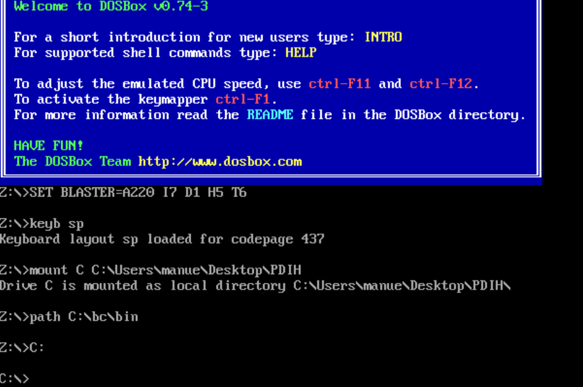
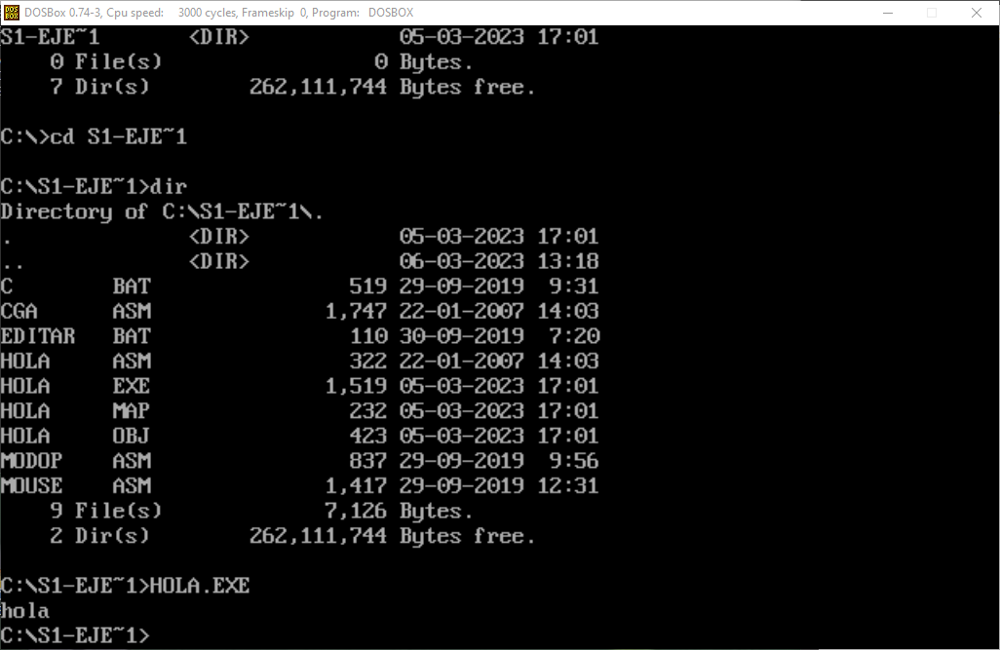
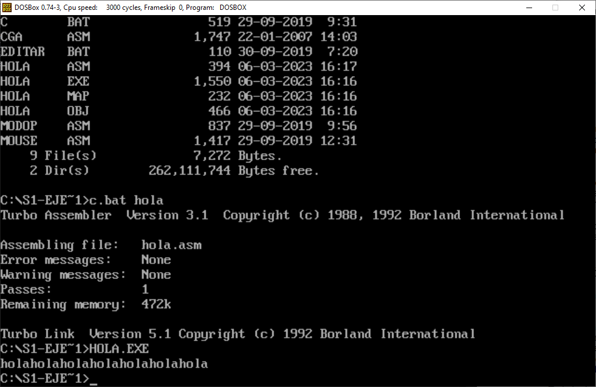

# Seminario 1 #

## Comprobación de la instalacion ##

Comprobacion de la instalación del software con la ejecucion de un juego:

---

## Modificacion del archivo de configuración ##

Configuracion del inicio de DOSBox modificando el archivo "dosbox-0.74-3.conf":

Comandos ejecutados al iniciar DOSBox:

---

## Hola Mundo ##

Ejecucion basica de Hola mundo:

Modificacion del código ensamblador con el bucle añadido:

~~~ asm
pila segment stack 'stack'
    dw 100h dup (?)
pila ends
datos segment 'data'
    msg db 'hola$'
datos ends
codigo segment 'code'
    assume cs:codigo, ds:datos, ss:pila
    main PROC
        mov ax,datos
        mov ds,ax
        mov cx,0

        bucle:
            mov dx,OFFSET msg
            mov ah,9
            int 21h

            inc cx
            cmp cx,7
            jne bucle
            
            mov ax,4C00h
            int 21h

    main ENDP
codigo ends

END main
~~~

Salida del programa resultante del codigo anterior descrito:

